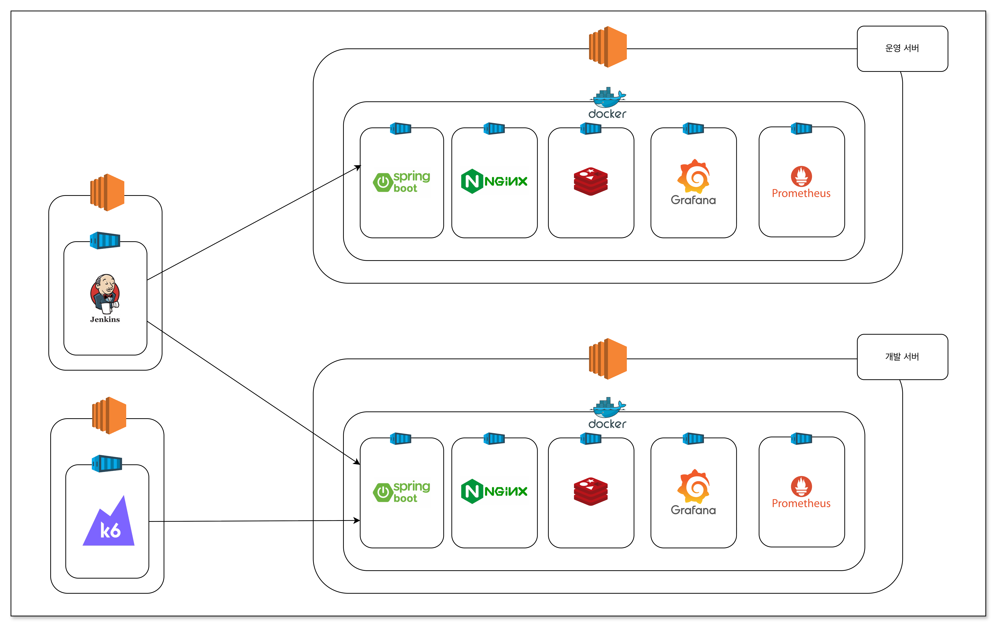

# 세모(SEMO) Backend

세모는 수학 문제 사진을 업로드하면 OCR/AI 분석을 통해 단원·유형을 추천하고, 사용자는 최소 수정만으로 오답카드를 생성/관리할 수 있는 서비스입니다.

## 개선 과정

- [페이지 최적화](https://recondite-bear-a3b.notion.site/2f65b82d76f480b9afa5f2b5f89a642f?source=copy_link)

- [비동기 파이프라인 개선](https://recondite-bear-a3b.notion.site/2f65b82d76f4803db2b5e124a14e1bfe?source=copy_link)

- [OCR 선택 과정](https://recondite-bear-a3b.notion.site/OCR-2e15b82d76f4805e84a5c9764f14fd3f?source=copy_link)

## Architecture

### Service/Infra Architecture

### System Architecture

## Tech Stack

- Java 17
- Spring Boot 3.5.x
- Gradle (Wrapper)
- MySQL, Redis
- JPA + QueryDSL
- Spring Security + JWT
- Swagger (springdoc-openapi)
- AWS S3 (Asset + Presigned URL)
- 외부 연동: Mathpix(OCR), Gemini(AI), Kakao/Apple OAuth

## 테스트/커버리지

- 단위 테스트: JUnit 5, Mockito
- 목표: 전체 커버리지 60%+ 유지, 주요 도메인/서비스 우선
- 현재: 65%+ 유지 중

## 주요 기능

### ProblemScan 파이프라인

- 사진 업로드 → `problem_scan` 작업카드 생성 → 원본 이미지를 `Asset(ORIGINAL)`로 S3 저장
- 비동기 OCR 수행 → 결과 저장 → 상태 `OCR_DONE`
- 비동기 AI 분류(단원/유형) 수행 → 결과 저장 → 상태 `AI_DONE`
- 추천 결과 기반으로 사용자가 최소 수정 후 최종 등록

### 운영 안정성(외부 API)

- 중복 처리 방지(락): `locked_at / lock_owner / lock_token`
- 재시도/백오프: `*_attempt_count`, `next_retry_at`
- 429(레이트리밋): 실패가 아니라 대기 성격으로 별도 상한/딜레이 정책
- 상태 전이 제한: `UPLOADED → OCR_DONE → AI_DONE` 또는 `FAILED`
- 원문 저장: `ocr_raw_json`(OCR), `ai_draft_json`(AI)

### 이미지/자산 관리

- Asset 테이블 SSOT: 원본/보정/크롭 자산 일원화
- `storage_key` 규칙화 및 Presigned URL 기반 조회

## 코드 구조(헥사고날)

- Hexagonal Architecture (Ports & Adapters)
  - 외부 시스템(S3/OCR/AI/OAuth)은 `port/out` + `adapter/out`로 분리
  - Controller는 요청 바인딩/검증/유스케이스 호출 중심으로 유지
  - 검증/가공/외부 호출/후처리는 Validator/Mapper/Client/PostProcessor로 분리

## 운영 관점 (Runbook)

### TraceId / 로그

- 모든 요청에 `X-Trace-Id`를 부여하고, 응답 헤더로도 내려줍니다.
- 에러 로그는 `traceId`, `errorCode`, `exType`, `exMsg`를 함께 남깁니다.

### 에러 처리 정책

- 비즈니스/도메인 에러는 `BusinessException` + `ErrorCode`로 통일합니다.
- 5xx(ErrorCode.status가 5xx)인 경우, 클라이언트에는 상세 메시지/데이터를 숨기고 기본 메시지를 내려줍니다.

### ProblemScan 워커 안정성(락/재시도)

- 중복 처리 방지: DB 기반 락(`locked_at / lock_owner / lock_token`)
- 재시도/백오프: `*_attempt_count`, `next_retry_at`
- AI는 429(레이트리밋) 케이스를 별도 카운트/상한으로 더 길게 허용합니다.

### 외부 연동(OAuth/OCR/AI) 실패 시 관점

- provider 4xx(잘못된 code/토큰 등): 인증 실패로 간주
- provider 5xx/timeout: 외부 시스템 장애로 간주(운영 알림/재시도 대상)

## Lint / Format (Spotless)

- 포맷 적용: `./gradlew spotlessApply`
- 포맷 검사: `./gradlew spotlessCheck`
